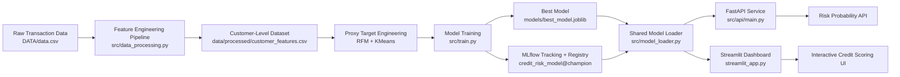

# Credit Risk Probability Model

An end-to-end credit risk scoring project for **Bati Bank** to support a **buy-now-pay-later** partnership with an eCommerce platform. This repository turns raw transaction behavior into a proxy credit-risk signal, trains and tracks models with MLflow, exposes predictions through FastAPI, and provides a Streamlit dashboard for interactive risk assessment.

## Launch The Dashboard

**Run this command to open the Streamlit app:**

**`.\.venv\Scripts\python.exe -m streamlit run streamlit_app.py`**

After startup, open `http://localhost:8501`.

## Table Of Contents

- [Project Overview](#project-overview)
- [Business Context](#business-context)
- [Credit Scoring Business Understanding](#credit-scoring-business-understanding)
- [System Architecture](#system-architecture)
- [Project Structure](#project-structure)
- [Feature Engineering Summary](#feature-engineering-summary)
- [Modeling Approach](#modeling-approach)
- [Quick Start](#quick-start)
- [Streamlit Dashboard](#streamlit-dashboard)
- [API](#api)
- [Testing And Quality Checks](#testing-and-quality-checks)
- [Docker](#docker)
- [Key Outputs](#key-outputs)
- [Current Verified Status](#current-verified-status)

## Project Overview

This project was built to solve a practical analytics engineering and ML problem:

- define a proxy target when direct default labels are unavailable
- engineer reproducible customer-level features from raw transactions
- train a model that estimates customer risk probability
- translate risk into an interpretable credit score
- provide simple loan amount and duration recommendations
- operationalize the model through an API and dashboard

The solution is organized as a repo that is ready for experimentation, testing, deployment, and GitHub submission.

## Business Context

Bati Bank wants to support credit-based purchases for eCommerce customers, but responsible lending requires a measurable and documented view of borrower risk. Since the source data is behavioral transaction data rather than traditional loan repayment history, the project uses customer engagement patterns as a proxy for default risk. The final product is not only a model, but a lightweight credit-risk platform with:

- automated feature generation
- proxy risk labeling
- model training and registration
- API-based scoring
- dashboard-based decision support

## Credit Scoring Business Understanding

### Basel II and interpretability

The Basel II Accord emphasizes disciplined credit-risk measurement, transparent documentation, and defensible decision-making. In practice, that means a bank should not depend on a model that is only accurate. The model must also be explainable enough for internal review, audit, and regulatory scrutiny. This project supports that requirement by keeping the data pipeline explicit, tracking experiments with MLflow, and documenting how the proxy target is created.

### Why a proxy target is necessary

The dataset does not contain a true loan-default label. Because supervised classification requires a target, the project creates a behavioral proxy based on **Recency, Frequency, and Monetary (RFM)** customer patterns. Customers in the least-engaged cluster are labeled as higher-risk proxies. This enables model training, but it also introduces business risk because a proxy is not a real repayment outcome. If the proxy is imperfect, the bank may under-estimate good customers or over-estimate risky ones.

### Simple vs. complex models in a regulated setting

Simple models such as Logistic Regression with Weight of Evidence are easier to explain, validate, and audit. More complex models such as Random Forest or Gradient Boosting can capture nonlinear relationships and often improve predictive performance, but they are harder to interpret and govern. In a regulated lending environment, the strongest solution is usually the one that balances predictive power with traceability, stability, and trust.

## System Architecture



## Project Structure

```text
Credit-Risk-Probability-Model/
|-- .github/
|   `-- workflows/
|       `-- ci.yml
|-- DATA/
|   |-- data.csv
|   |-- data.xlsx
|   |-- Xente_Variable_Definitions.csv
|   `-- Xente_Variable_Definitions.xlsx
|-- notebooks/
|   `-- 1.0-eda.ipynb
|-- src/
|   |-- api/
|   |   |-- __init__.py
|   |   |-- main.py
|   |   `-- pydantic_models.py
|   |-- __init__.py
|   |-- aggregate_features.py
|   |-- config.py
|   |-- data_processing.py
|   |-- feature.py
|   |-- model_loader.py
|   |-- predict.py
|   `-- train.py
|-- tests/
|   `-- test_data_processing.py
|-- streamlit_app.py
|-- Dockerfile
|-- docker-compose.yml
|-- README.md
`-- requirements.txt
```

## Feature Engineering Summary

The pipeline converts raw transaction rows into customer-level modeling features. Key engineered features include:

- `TotalTransactionAmount`
- `AverageTransactionAmount`
- `TransactionCount`
- `StdDevTransactionAmount`
- `MaxTransactionAmount`
- `TotalValue`
- `AverageTransactionHour`
- `StdTransactionHour`
- `AverageTransactionDay`
- `StdTransactionDay`
- `AverageTransactionMonth`
- `StdTransactionMonth`
- `AverageTransactionYear`
- `recency_days`
- `frequency`
- `monetary`

Categorical features such as `CurrencyCode`, `ProviderId`, `ProductCategory`, and `ChannelId` are handled through preprocessing and one-hot encoding inside the training pipeline.

## Modeling Approach

### Proxy target engineering

The project creates `is_high_risk` using RFM-based customer segmentation:

1. compute recency, frequency, and monetary metrics per customer
2. standardize the RFM feature space
3. cluster customers into 3 groups using KMeans
4. identify the least-engaged cluster as the high-risk proxy group

### Candidate models

The training workflow evaluates at least:

- Logistic Regression
- Random Forest

The best model is selected using grid search and ROC-AUC, then:

- saved locally as `models/best_model.joblib`
- logged to MLflow
- registered under `credit_risk_model`
- assigned the alias `champion`

### Prediction outputs

For each scored customer, the system returns:

- risk probability
- risk label
- credit score
- recommended loan amount
- recommended loan duration

## Quick Start

### 1. Create and activate the environment

```powershell
python -m venv .venv
.\.venv\Scripts\activate
python -m pip install --upgrade pip
python -m pip install -r requirements.txt
```

### 2. Build the processed dataset

```powershell
.\.venv\Scripts\python.exe -m src.data_processing --input DATA\data.csv --output data\processed\customer_features.csv
```

### 3. Train and register the model

```powershell
.\.venv\Scripts\python.exe -m src.train --input DATA\data.csv --output models\best_model.joblib --processed-output data\processed\customer_features.csv
```

### 4. Run the FastAPI service

```powershell
.\.venv\Scripts\python.exe -m uvicorn src.api.main:app --host 0.0.0.0 --port 8000
```

Open `http://localhost:8000/docs`.

### 5. Run the Streamlit dashboard

**`.\.venv\Scripts\python.exe -m streamlit run streamlit_app.py`**

Open `http://localhost:8501`.

## Streamlit Dashboard

The dashboard is designed for quick manual scoring and demo-friendly exploration. It provides:

- single-customer scoring from sidebar inputs
- model-backed risk probability estimation
- derived credit score display
- recommended loan amount and duration
- batch CSV scoring for multiple customers
- prediction export as CSV
- preview of the processed customer feature dataset

## API

### Endpoints

- `GET /` returns service metadata
- `GET /health` returns health status and active model source
- `POST /predict` scores a customer and returns prediction outputs

### Example request payload

```json
{
  "CurrencyCode": "UGX",
  "CountryCode": 256,
  "ProviderId": "ProviderId_4",
  "ProductId": "ProductId_6",
  "ProductCategory": "financial_services",
  "ChannelId": "ChannelId_2",
  "PricingStrategy": 2,
  "FraudResult": 0,
  "TotalTransactionAmount": 12500.0,
  "AverageTransactionAmount": 625.0,
  "TransactionCount": 20,
  "StdDevTransactionAmount": 240.5,
  "MaxTransactionAmount": 1500.0,
  "TotalValue": 12500.0,
  "AverageTransactionHour": 14.0,
  "StdTransactionHour": 4.2,
  "AverageTransactionDay": 15.0,
  "StdTransactionDay": 6.1,
  "AverageTransactionMonth": 7.0,
  "StdTransactionMonth": 2.0,
  "AverageTransactionYear": 2018.0,
  "recency_days": 12.0,
  "frequency": 20,
  "monetary": 12500.0
}
```

## Testing And Quality Checks

Run the automated checks with:

```powershell
.\.venv\Scripts\python.exe -m pytest tests -q
.\.venv\Scripts\python.exe -m flake8 src tests streamlit_app.py --max-line-length=120 --count --show-source --statistics
.\.venv\Scripts\python.exe -m black --check src tests streamlit_app.py --line-length=120
```

## Docker

```powershell
docker build -t credit-risk-api .
docker-compose up --build
```

## Key Outputs

- processed dataset: `data/processed/customer_features.csv`
- trained model: `models/best_model.joblib`
- MLflow tracking store: `mlruns/`
- Streamlit application: `streamlit_app.py`
- FastAPI service: `src/api/main.py`

## Current Verified Status

The repository has been verified locally with the following checks completed successfully:

- processed dataset generation
- model training
- MLflow model registration
- FastAPI startup and prediction
- Streamlit model loading
- unit tests passing
- lint and formatting checks passing
